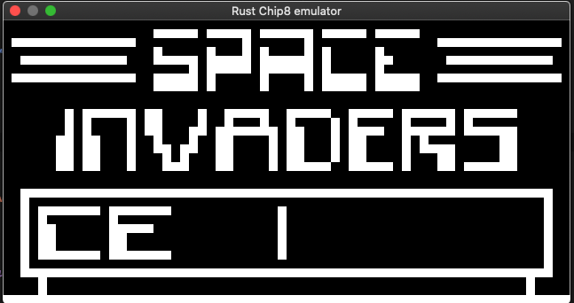
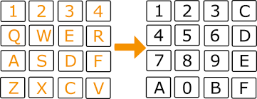

## Chip8 Emulator using Rust

Created this basic chip8 emulator to learn more about emulator programming as well as Rust language.
There are pending features to be implemented like `Sound` which will be added soon.

Games are included in `data` folder.

### Screenshot




### Keyboard Map



### Build
For production build 
```
cargo build --release
```

and give the same path as argument like.. 

```
./chip-8-rust programs/INVADERS 
```

For developers please use  `cargo run` inside the project directory to start